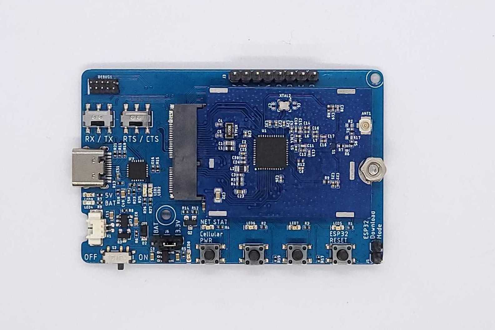
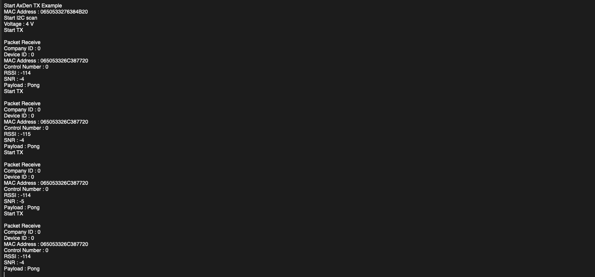
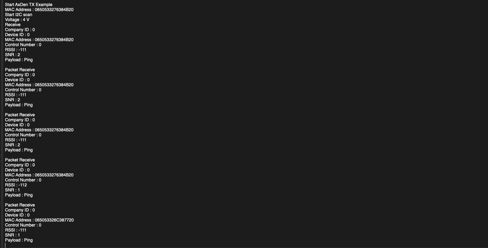
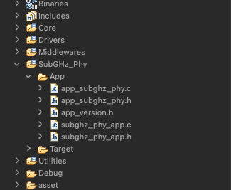
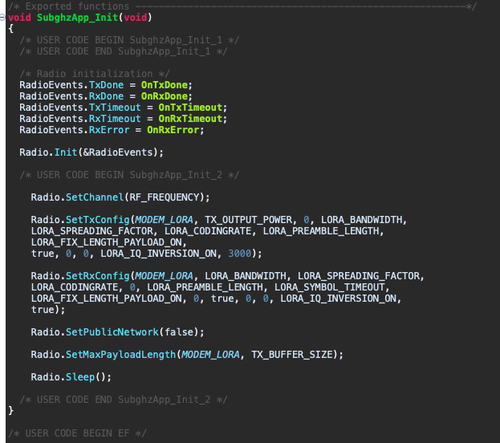
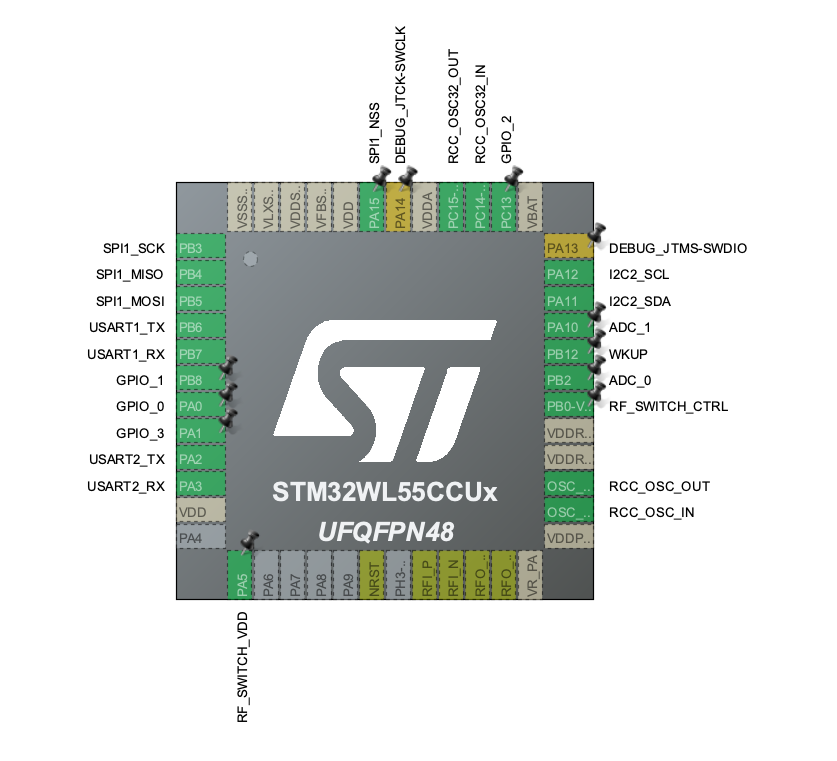

# STM32WL55 LORA Ping pong example



<br>
<br>
This is an example of LORA communication between STM32WL55 cards, and the frequency band of 868 ~ 928Mhz is used.
<br>
Long-distance wireless communication of up to 30Km is possible, and it has advantages in space, low power, and price compared to the structure that generally uses SX1276 + separate MCU.
<br>
<br>
Related hardware kits can be purchased from the Naver Smart Store.
<br>

[Purchase Link : naver smart store](https://smartstore.naver.com/axden)

<br>
<br>

You can purchase it by contacting sales@axden.io

-----------------------

### STM32WL55 LORA Ping pong terminal
<br>

baudrate : 9600
<br>

<table>
<tr align="center">
  <td>TX</td>
</tr>
  <tr align="center">
    <td></td>
  </tr>
</table>

<table>
<tr align="center">
  <td>RX</td>
</tr>
  <tr align="center">
    <td></td>
  </tr>
</table>

<br>

-----------------------

### STM32WL55 Radio setup


<br>

SubGHZ-Phy / App / subghz_phy_app.c

```
#define REGION_AS923

#if defined( REGION_AS923 )

#define RF_FREQUENCY                                923000000 // Hz

#elif defined( REGION_AU915 )

#define RF_FREQUENCY                                915000000 // Hz

#elif defined( REGION_CN470 )

#define RF_FREQUENCY                                470000000 // Hz

#elif defined( REGION_CN779 )

#define RF_FREQUENCY                                779000000 // Hz

#elif defined( REGION_EU433 )

#define RF_FREQUENCY                                433000000 // Hz

#elif defined( REGION_EU868 )

#define RF_FREQUENCY                                868000000 // Hz

#elif defined( REGION_KR920 )

#define RF_FREQUENCY                                920000000 // Hz

#elif defined( REGION_IN865 )

#define RF_FREQUENCY                                865000000 // Hz

#elif defined( REGION_US915 )

#define RF_FREQUENCY                                915000000 // Hz

#elif defined( REGION_RU864 )

#define RF_FREQUENCY                                864000000 // Hz

#else
#error "Please define a frequency band in the compiler options."
#endif

#define TX_OUTPUT_POWER 14

#define LORA_BANDWIDTH                              0         // [0: 125 kHz,
//  1: 250 kHz,
//  2: 500 kHz,
//  3: Reserved]
#define LORA_SPREADING_FACTOR                       10         // [SF7..SF12]
#define LORA_CODINGRATE                             1         // [1: 4/5,
//  2: 4/6,
//  3: 4/7,
//  4: 4/8]
#define LORA_PREAMBLE_LENGTH                        8         // Same for Tx and Rx
#define LORA_SYMBOL_TIMEOUT                         5         // Symbols
#define LORA_FIX_LENGTH_PAYLOAD_ON                  false
#define LORA_IQ_INVERSION_ON                        false

#define TX_BUFFER_SIZE 128
#define RX_BUFFER_SIZE 128

```
<br>


<br>

-----------------------

### Note
<br>

Works with STM32CubeIDE Version: 1.8.0, freeRTOS CMSIS_V2, Single-core
<br>

STM32WL55 module only support RFO_H
<br>

RF Switch IC MPN : BGS12SN6E6327XTSA1
<br>

-------------------------

### STM32WL55 Pin map


